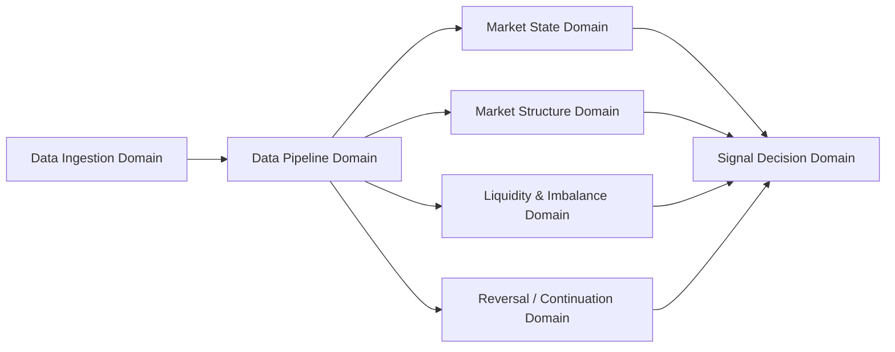

# Domain Dependency Map

## Purpose
This document defines the allowed dependency direction between domains in the Signal Capture System.

## Dependency Direction

## Dependency Rules
- Data Ingestion Domain provides intake to Data Pipeline Domain.
- Data Pipeline Domain distributes standardized data to analysis domains.
- Analysis domains do not depend on Signal Decision Domain.
- Signal Decision Domain may read outputs from analysis domains.
- Signal Decision Domain does not own upstream analysis objects.
- No circular dependency is allowed.

## Read / Write Rule
- Upstream domains own their own objects.
- Downstream domains may read the upstream outputs only.
- Downstream domains must not modify upstream-owned objects.

