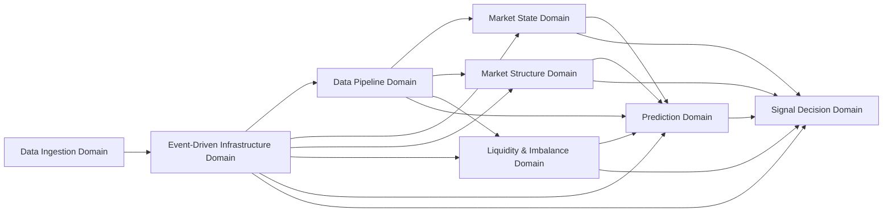

# Domain Dependency Map

## Purpose
This document defines the allowed dependency direction between domains in the Signal Capture System.

## Dependency Direction

## Dependency Rules
- Data Ingestion Domain provides intake to the event infrastructure layer.
- Event-Driven Infrastructure Domain routes events to subscribed domains.
- Data Pipeline Domain distributes standardized data to analysis domains through events.
- Analysis domains do not depend on Signal Decision Domain.
- Prediction Domain may read outputs from upstream analysis domains.
- Signal Decision Domain may read outputs from analysis domains.
- Signal Decision Domain does not own upstream analysis objects.
- Domain-to-domain direct calls are forbidden.
- No circular dependency is allowed.

## Read / Write Rule
- Upstream domains own their own objects.
- Downstream domains may read the upstream outputs only.
- Downstream domains must not modify upstream-owned objects.
- Event infrastructure may route and notify, but it must not own business objects.
