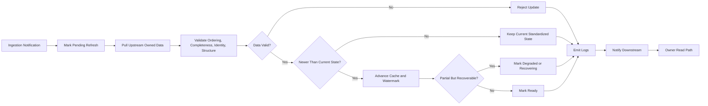

# Data Pipeline Domain SDS

## Document Information
- Version: V1.2
- Status: Freeze
- Domain: Data Pipeline Domain
- Scope: Signal Capture System

## 中文说明
Data Pipeline Domain 是市场数据接入与下游分析之间的标准化数据分发层。
它不拥有原始市场接入，不解释市场含义，不生成信号。
它的职责是消费接入通知，拉取上游已拥有的数据，完成标准化与对齐，并向下游分发稳定可用的数据。

- 入口仍然是 `Data Ingestion Domain`
- 本域不负责行情判断
- 本域不负责信号生成
- 本域的作用是把实时变化的数据整理成下游可稳定使用的数据
- 本域是接入层和分析层之间的桥，不是决策层

## 1. System Definition
### Identity
- This Domain is: Data Pipeline Domain
- Goal: Consume ingestion notifications, pull upstream owned data, normalize and align market data, and distribute standardized outputs to downstream analysis domains
- System Role: Standardized data distribution bridge between ingestion and analysis domains

### Description
- This Domain represents the stable behavior boundary for consuming upstream change notifications, reconciling owned upstream data, and producing analysis-ready standardized data

### 中文理解
- 核心任务不是“看懂行情”，而是“把行情整理好”。
- 先接收上游变更通知，再拉取上游最新已拥有的数据。
- 随后完成时间对齐、结构对齐、标准化和分发。
- 下游拿到的是统一口径、稳定可用的数据，而不是原始碎片数据。

### Constraint
- Do not describe implementation details.
- Do not describe programming language, framework, data structure, algorithm, or implementation method.

## 2. Domain Boundary
### In Scope
- Consume ingestion notifications
- Pull latest owned data from upstream domains when notified
- Validate data completeness and ordering
- Reconcile timing and structural consistency
- Normalize data into domain-consistent formats
- Maintain pipeline cache and delivery state
- Repair or mark recoverable data gaps when possible
- Detect stale, duplicated, missing, or out-of-order records
- Maintain replay and recovery eligibility for recent pipeline data
- Distribute standardized data to downstream domains
- Publish change notifications when pipeline state changes
- Generate operational and audit logs for pipeline behavior

### Out of Scope
- Raw market intake ownership
- Market interpretation
- Trend analysis
- Structure recognition
- Liquidity analysis
- Signal generation
- Trade execution
- Position management
- Ownership of upstream ingestion objects
- Direct modification of upstream raw data ownership
- Final decision making for any downstream signal

### 中文说明
- 输入范围只包括上游通知、上游已拥有数据、恢复请求和配置类控制。
- 输出范围只包括标准化结果、状态查询结果和变更通知。
- 任何“市场到底意味着什么”的判断，都不属于这个域。

### Boundary Rule
- This Domain owns only the responsibilities explicitly listed in this document.

## 3. Managed Objects
### Owned Objects
- Pipeline State
- Standardized Data
- Cache State
- Delivery State
- Validation Status
- Recovery State
- Watermark State
- Log Records

### 中文说明
- `Pipeline State`：当前管道整体是否健康、是否可交付。
- `Standardized Data`：已经统一格式、统一口径的数据。
- `Cache State`：缓存中保留的数据范围和有效性。
- `Delivery State`：数据是否已准备好交付给下游。
- `Validation Status`：校验结果和异常标记。
- `Recovery State`：最近一次恢复、补齐、重放的状态。
- `Watermark State`：当前处理到哪个时间边界，便于判定是否落后或缺口未清。
- `Log Records`：用于记录运行、校验、恢复、分发和异常追踪信息的日志对象。

### Ownership Rule
- Each object must have exactly one Owner Domain.
- Non-owner Domains may read the object only.
- Non-owner Domains must not modify the object.

## 4. Runtime Status
### Status Items
- Health
- Ready
- Degraded
- Recovering

### Status Meaning
- Health indicates the current runtime condition of this Domain.
- Ready indicates whether this Domain can provide standardized pipeline service.
- Degraded indicates the domain can still serve data, but data quality or freshness is reduced.
- Recovering indicates the domain is actively backfilling, repairing, or re-synchronizing data.

### 中文说明
- `Health` 说明当前进程和服务本身是否正常。
- `Ready` 说明当前是否已经具备可供下游稳定消费的能力。
- `Degraded` 说明还能工作，但存在延迟、缺口、回补中等情况。
- `Recovering` 说明正在补数据或重建状态，暂时不应被视为完全稳定。

### Query Rule
- Runtime status must be queryable.
- Downstream systems must not infer runtime status indirectly.

## 5. Input
### Accepted Inputs
- Upstream market data
- Ingestion change notifications
- Recovery requests
- Configuration updates
- Runtime control requests
- Replay or backfill commands
- Data quality alerts
- Log query requests
- Audit and trace lookup requests

### 中文说明
- 上游市场数据是主输入。
- 通知类输入用于感知上游状态变化，不替代真实数据。
- 恢复类输入用于补齐缺失、修正断点或重建缓存。
- 配置类输入只影响策略参数，不改变域边界。

### Input Rule
- Input must be interpreted only within the Domain boundary.

## 6. Output
### Produced Outputs
- Standardized market data
- Pipeline change notifications
- Validation results
- Recovery status
- Runtime status
- Data quality summary
- Delivery readiness signal
- Log records
- Audit trail responses

### 中文说明
- 标准化市场数据是供下游消费的主输出。
- 变更通知只负责提醒状态变化，不承载完整业务对象。
- 校验结果和恢复状态用于让外部系统知道当前数据是否可靠。
- `Delivery readiness signal` 用于表达数据是否已经达到交付条件。

### Output Rule
- Output must remain consistent with Domain responsibilities and ownership rules.

## 7. Responsibilities
### Long-Term Responsibilities
- Receive Data
- Validate Data
- Normalize Data
- Maintain Cache
- Maintain Delivery State
- Repair Data Gaps
- Notify Changes
- Provide Read Access
- Track Watermarks
- Support Replay
- Expose Data Quality
- Emit Logs
- Retain Audit Trails
- Provide Traceability

### 中文说明
- `Receive Data`：接收并接管上游输入。
- `Validate Data`：检查完整性、顺序和可用性。
- `Normalize Data`：统一格式、字段语义和输出口径。
- `Maintain Cache`：保留近期可用数据，支持快速读取和恢复。
- `Maintain Delivery State`：维护下游是否可交付、是否待修复。
- `Repair Data Gaps`：在允许时补齐缺口、修正断层。
- `Notify Changes`：向下游发出状态变化提醒。
- `Provide Read Access`：为允许的下游读取标准数据提供入口。
- `Track Watermarks`：记录当前处理边界，避免重复处理或遗漏。
- `Support Replay`：支持近期数据回放和重建。
- `Expose Data Quality`：向外暴露当前质量摘要和风险状态。
- `Emit Logs`：为关键生命周期事件、异常和恢复动作生成日志。
- `Retain Audit Trails`：保留可追踪的审计痕迹，便于排障和复盘。
- `Provide Traceability`：让外部能够通过日志关联关键状态变化。

### Responsibility Rule
- Responsibilities must be written as verb phrases.
- Responsibilities must remain stable over time.

## 8. Behavior Rules
### Behavior Model
- When an ingestion notification arrives, the domain marks the affected dataset as potentially changed and begins a pull of the upstream owned data for that dataset.
- After the pull, the domain compares the newly pulled data with the current standardized cache for the same symbol and timeframe.
- If the new data is newer and consistent, the domain replaces or advances the existing standardized state.
- If the new data is partial but recoverable, the domain keeps the last valid state, records the gap in recovery status, and may expose the result as degraded.
- If the new data is inconsistent, duplicated, or out of order, the domain rejects the update, records validation failure, and preserves the last valid reconciled state.
- If a recovery or replay action is required, the domain updates the watermark only after the dataset has been reconciled to a new stable boundary.
- Downstream domains receive a change notification after the standardized state changes, then read the latest standardized result through the owner read path.
- Every read result must include version metadata, watermark metadata, and current status metadata so downstream consumers can decide whether the result is normal, degraded, or transitional.

### Processing Flow
1. Receive ingestion notification for a changed dataset.
2. Mark the target symbol and timeframe as pending refresh.
3. Pull the latest owned upstream data for that dataset.
4. Validate ordering, completeness, identity, and structural consistency.
5. Compare the pulled data with the current standardized state.
6. If the data is valid and newer, advance the standardized cache and watermark.
7. If the data is partial but recoverable, preserve the last valid state and mark the dataset degraded or recovering.
8. If the data is invalid, reject the update and keep the last reconciled state.
9. Emit logs for the pull, validation, reconciliation, and result.
10. Publish a downstream change notification when the standardized state changes.
11. Expose the updated standardized data through the owner read path with version and watermark metadata.

### Flow Diagram

### Must
- Must consume ingestion notifications before any upstream data pull
- Must treat the notification as a trigger, not as the data payload itself
- Must pull only the latest owned data from upstream domains
- Must compare pulled data against the current standardized state before replacing it
- Must preserve the last valid reconciled state when the new input is partial but recoverable
- Must reject updates that are inconsistent, duplicated, or out of order
- Must advance the watermark only when reconciliation is complete for the new boundary
- Must notify downstream domains after standardized state changes
- Must expose runtime status, version, and watermark metadata on every read result
- Must allow downstream consumers to read standardized data only through the owner read path
- Must classify read behavior as `Ready` for normal use, `Degraded` for cautious use, and `Recovering` for transitional use
- Must emit logs for notification receipt, upstream pull, comparison, validation, reconciliation, recovery, delivery, and error events
- Must follow the processing flow in the stated order unless recovery policy explicitly changes the sequence

### Must Not
- Must not treat a notification as a replacement for owned upstream data
- Must not publish a new standardized state before comparison and reconciliation
- Must not advance the watermark across unresolved gaps
- Must not overwrite the last valid state with partial or inconsistent data
- Must not let downstream consumers read internal cache objects directly
- Must not present stale or lower-version data as the latest reconciled state
- Must not omit status, version, or watermark metadata from downstream reads
- Must not use logs as a substitute for standardized data or state ownership

### 中文说明
- 这个域的行为不是“收到数据就发出去”，而是“收到通知后去拉取、比对、对齐、再发布”。
- 新数据只有在比对通过、结构对齐、时间对齐之后，才可以替换旧的标准化状态。
- 如果数据只补齐了一部分，旧的稳定状态要保留，同时把当前状态标成 `Degraded` 或 `Recovering`。
- 水位线不是摆设，它表示这个域已经稳定处理到哪一根边界。
- 下游不是直接读缓存实现，而是读带着版本、水位线和状态的标准化结果。
- `Ready` 表示可按正常路径消费，`Degraded` 表示能读但要谨慎，`Recovering` 表示正在过渡中。
- 处理顺序是固定的：通知、标记、拉取、校验、比对、更新、记录、通知下游、对外可读。
- 这不是纯缓存域，也不是纯分发域，而是带有校验和重整语义的标准化管道域。

### Must Not
- Must not perform market interpretation
- Must not generate trading signals
- Must not redefine upstream ingestion responsibilities
- Must not modify non-owned objects
- Must not hide runtime status from query access
- Must not describe implementation methods
- Must not let downstream domains mutate standardized objects directly
- Must not silently discard unrecoverable data without surfacing a status change
- Must not collapse multiple ownership boundaries into one pipeline object
- Must not use logs as a substitute for business state ownership
- Must not expose sensitive upstream raw payloads through logs unless Policy explicitly allows it
- Must not serve stale or lower-version data as if it were the latest reconciled state
- Must not let downstream consumers bypass status, version, or watermark checks
- Must not let cache internals become a cross-domain contract

## 9. System Policy
### Current Policy
- Validation strictness: configurable
- Cache retention: configurable
- Recovery behavior: configurable
- Distribution policy: configurable
- Freshness threshold: configurable
- Backfill depth: configurable
- Retry policy: configurable
- Log retention: configurable
- Log verbosity: configurable
- Audit retention: configurable

### 中文说明
- 验证严格度决定是否允许轻微异常数据进入缓冲或直接拒绝。
- 缓存保留时间决定最近数据可以保留多久、支持多深的回放。
- 恢复行为决定断点后是自动补齐、等待人工介入，还是进入降级模式。
- 分发策略决定哪些下游可以拿到哪些级别的数据。
- 新鲜度阈值决定数据延迟到什么程度算可用、可降级或不可用。
- 回补深度决定最多允许向前追溯多少窗口。
- 重试策略决定在失败后如何重新拉取或重放。
- 日志保留决定可追溯范围。
- 日志级别决定记录多少运行细节。
- 审计保留决定审计与排障历史可以保留多久。

### Policy Rule
- Policy may change across versions.
- Policy must not rewrite the SDS behavior definition.

### Policy Source
- YAML
- Configuration file
- Version policy document

## 10. Interaction
### Internal Interaction
- Receive data from Data Ingestion Domain
- Provide standardized outputs to analysis domains
- Publish change notifications to downstream consumers
- Exchange recovery signals with Data Ingestion Domain
- Provide data quality and delivery state to monitoring consumers

### 中文说明
- 这个域和接入域之间是前后衔接关系，不是并列竞争关系。
- 它向分析域输出的是标准化数据，向监控侧输出的是质量和交付状态。
- 恢复信号用于协调上游补数和本域补齐动作。

### External Interaction
- Event Notify + Data Pull

### Interaction Rule
- Events notify state changes only.
- Business data must be pulled from the owner domain.
- Events must not carry business objects.

## 11. Cache Access Contract
### Contract
- Cache is owned and maintained by Data Pipeline Domain.
- Downstream domains may access standardized data only through the owner read path.
- Downstream domains must not access internal cache objects directly.
- Cached data must be exposed as standardized data, not as pipeline internals.
- Downstream domains must rely on status and version metadata to judge freshness and readiness.
- Cache contents may support recovery, replay, and delivery, but ownership never leaves this domain.

### Read Conditions
- The downstream consumer must be an allowed domain.
- The request must target standardized data owned by this domain.
- The request must include enough identity information to locate the data set, such as symbol and timeframe.
- The request must include or derive a version boundary or watermark boundary when freshness matters.
- The request must be evaluated against current runtime status before data is served.
- The request must not bypass status or version checks.

### Version And Watermark Rules
- Standardized data must be returned with version metadata.
- Watermark metadata must indicate the latest fully reconciled boundary.
- Downstream consumers must use version and watermark metadata to detect freshness, replay eligibility, and completeness.
- A newer version supersedes an older version for the same owned data set.
- A watermark must never move backward without an explicit recovery or replay action.

### Status-Based Read Semantics
- When `Ready` is true, downstream consumers may treat the returned standardized data as the normal consumption path.
- When `Degraded` is true, downstream consumers may still read data, but they must also read quality and freshness metadata before use.
- When `Recovering` is true, downstream consumers may read data only if they can tolerate partial freshness or replay state, and they must treat the result as transitional.
- When the domain is not ready and not explicitly degraded or recovering, the read path must not present the data as stable for downstream use.

### 中文说明
- 缓存是本域自己的状态，不是公共共享内存。
- 下游拿到的是读取结果，不是缓存实现本身。
- 下游是否继续使用数据，必须结合状态和版本来判断。
- 缓存可以帮助恢复、回放和分发，但不会把所有权交出去。
- 读取前要确认下游身份、数据标识、版本边界和运行状态。
- 版本和水位线一起决定数据是不是最新、是否完整、能不能回放。
- `Ready` 表示正常可用，`Degraded` 表示可读但要谨慎，`Recovering` 表示可读但结果是过渡态。

### Downstream Read Semantics
- Downstream domains must treat the owner read path as the only supported access path for standardized data.
- Downstream domains must combine returned standardized data with status, version, and watermark metadata before use.
- Downstream domains must not assume freshness from data presence alone.
- Downstream domains must treat version metadata as the identity of the returned standardized dataset state.
- Downstream domains must treat watermark metadata as the latest fully reconciled boundary.
- Downstream domains must consider the read result transitional when status is not Ready.

### 中文说明
- 下游不能把“拿到数据”理解成“数据一定可直接使用”。
- 是否可用，必须结合状态、版本和水位线一起判断。
- `Ready` 之外的读取结果都不应该被视为完全稳定的正常态。

### Cache Delivery Rule
- The owner read path may return standardized data, metadata, or both according to downstream need.
- The owner read path must preserve domain ownership even when replay, backfill, or recovery is in progress.
- The owner read path must remain consistent with current runtime status and version boundaries.

## 12. Output Guarantee
### Guarantee
- This Domain guarantees standardized and queryable pipeline behavior for validated inputs when Ready is true
- This Domain guarantees that downstream consumers can obtain the latest standardized data through the owner read path when Ready is true

### Guarantee Boundary
- Unless Policy states otherwise, guarantees apply only when Ready is true.

### 中文说明
- 只要 `Ready = true`，下游就应当能够按 owner read 的方式拿到可用的标准化数据。
- 如果处于 `Degraded` 或 `Recovering`，系统仍可输出，但必须同时暴露状态。

## 13. Forbidden
### Forbidden Behaviors
- Must not modify non-owned objects.
- Must not introduce circular dependencies.
- Must not bypass architecture dependency rules.
- Must not redefine Foundation.
- Must not mix Policy into SDS behavior definitions.
- Must not describe implementation details.
- Must not use pipeline logic to replace analysis or decision domains
- Must not hide quality degradation behind a normal-looking output

## 14. Future
### Future Extension
- Additional standardized output formats
- Broader recovery scenarios
- Expanded distribution targets
- Hot standby pipeline
- Cross-venue normalization support

### Future Rule
- Future items must not weaken the current stable design.
